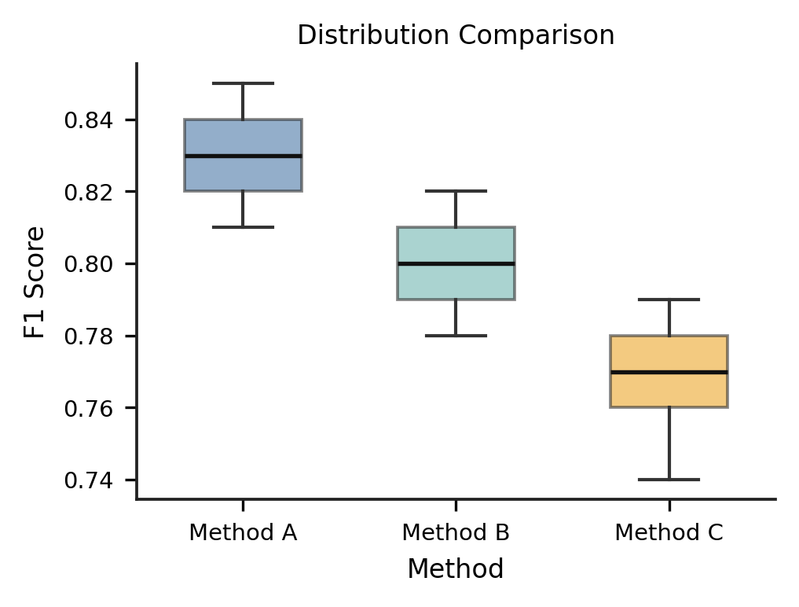

# PaperPlot

PaperPlot is a Matplotlib-based framework for publication-quality scientific figures with consistent styles, venue-aware defaults, and reusable plot templates.

## Current scope

The repository currently includes:

* profile, style, template, and plotter registries
* built-in venue profiles and visual styles
* template-driven rendering for line, scatter, bar, grouped bar, histogram, box, heatmap, radar, table, and composite layouts
* JSON/YAML config loading and project-local asset autoloading
* `use_style(...)` for existing Matplotlib workflows
* `plot(...)`, `render_template(...)`, and `plot_from_config(...)` for Python-side rendering
* `managed_figure(...)` for automatic figure cleanup around returned results
* a CLI for rendering, validation, asset loading, gallery generation, and registry listing
* a built-in gallery plus visual regression baselines
* smoke, config, CLI, and visual regression tests

## Quick example

```python
from paperplot import plot

data = {
    "epoch": [1, 2, 3, 1, 2, 3],
    "acc": [70, 73, 75, 68, 71, 74],
    "method": ["A", "A", "A", "B", "B", "B"],
}

plot(
    template="line.sota_compare",
    data=data,
    x="epoch",
    y="acc",
    hue="method",
    output="figures/acc.pdf",
)
```

If you keep returned figures around in long-running scripts or notebooks, close them explicitly after saving or inspection:

```python
import matplotlib.pyplot as plt
from paperplot import plot

fig, ax, spec = plot(
    template="line.sota_compare",
    data=data,
    x="epoch",
    y="acc",
    hue="method",
)

plt.close(fig)
```

If you want automatic cleanup around the existing return value, use `managed_figure(...)`:

```python
from paperplot import managed_figure, plot

with managed_figure(
    plot(
        template="line.sota_compare",
        data=data,
        x="epoch",
        y="acc",
        hue="method",
    )
) as (fig, ax, spec):
    print(ax.get_xlabel())
```

## Config-driven plotting

```python
from paperplot import plot_from_config

config = {
    "paper": {
        "profile": "neurips",
        "style": "academic-bright",
    },
    "figure": {
        "template": "bar.ablation",
        "data": {
            "component": ["base", "w/o aug", "w/o schedule"],
            "score": [82.1, 79.8, 80.4],
        },
        "x": "component",
        "y": "score",
        "output": "figures/ablation.pdf",
    },
}

plot_from_config(config)
```

`plot_from_config("examples/bar_ablation.yaml")` is supported directly. When `PyYAML` is installed it is used; otherwise PaperPlot falls back to a built-in parser that supports the project’s config/asset subset.

The same figure-lifecycle rule applies to `plot_from_config(...)`: if you keep the returned figure object, close it when you are done.

Supported config inputs:

* Python mappings
* `.json`
* `.yaml` / `.yml`

## Scientific Color Advisor

PaperPlot can use the vendored `scientific-color-advisor` catalog to recommend paper-safe palettes automatically and keep semantic labels mapped to the same colors across a whole paper.

Typical use cases:

* automatically pick safer categorical palettes for line, scatter, grouped-bar, and box plots
* switch heatmaps to more appropriate sequential or diverging ramps
* keep labels like `Ours`, `Baseline`, and `Ablation` color-stable across separately rendered figures
* infer `series_count` from the actual figure data so 2-series manuscript plots prefer restrained but still separated colors

Example config:

```yaml
paper:
  profile: icml
  style: academic-muted
  color_advisor:
    enabled: true
    usage: manuscript
    tone: restrained
    priorities: [colorblind-safe, grayscale-safe, avoid-red-green]
    namespace: paper-demo
    persist_path: color_advisor/paper-colors.json
    preferred_order: [Ours, Baseline, Ablation]
    bindings:
      Ours: primary
      Baseline: secondary

figure:
  template: line.sota_compare
  data:
    epoch: [1, 2, 3, 1, 2, 3]
    acc: [74.1, 76.8, 78.3, 71.9, 73.5, 74.8]
    method: [Ours, Ours, Ours, Baseline, Baseline, Baseline]
  x: epoch
  y: acc
  hue: method
```

See the full example at [examples/icml_color_advisor.yaml](./examples/icml_color_advisor.yaml). For detailed usage, see:

* [docs/COLOR_ADVISOR_cn.md](./docs/COLOR_ADVISOR_cn.md)
* [docs/CLI.md](./docs/CLI.md)
* [docs/OVERRIDES.md](./docs/OVERRIDES.md)

## External assets

PaperPlot can autoload project-local profile, style, and template assets from files.

```python
from paperplot import autoload_project_assets

autoload_project_assets(".")
```

Supported locations:

* `./paperplot_assets/profiles`, `./paperplot_assets/styles`, `./paperplot_assets/templates`
* `./.paperplot/profiles`, `./.paperplot/styles`, `./.paperplot/templates`
* `./profiles`, `./styles`, `./templates`

Supported file formats:

* `.json`
* `.yaml` / `.yml`

Example:

```python
from paperplot import autoload_project_assets, plot

autoload_project_assets("examples/assets")

plot(
    template="bar.lab",
    profile="lab",
    visual="lab-muted",
    data={"model": ["A", "B", "C"], "score": [81.2, 83.4, 82.7]},
    x="model",
    y="score",
)
```

Additional example configs:

* [scatter_clusters.yaml](./examples/scatter_clusters.yaml)
* [heatmap_metrics.yaml](./examples/heatmap_metrics.yaml)
* [report_layout.yaml](./examples/report_layout.yaml)
* [grouped_ablation_significance.yaml](./examples/grouped_ablation_significance.yaml)
* [icml_scaling_law.yaml](./examples/icml_scaling_law.yaml)
* [cvpr_pareto_frontier.yaml](./examples/cvpr_pareto_frontier.yaml)
* [acl_benchmark_matrix.yaml](./examples/acl_benchmark_matrix.yaml)
* [iclr_benchmark_compare.yaml](./examples/iclr_benchmark_compare.yaml)
* [cvpr_paper_summary.yaml](./examples/cvpr_paper_summary.yaml)

Override guide:

* [Overriding Figures in PaperPlot](./docs/OVERRIDES.md)
* [Color Advisor Guide (CN)](./docs/COLOR_ADVISOR_cn.md)

### Award-inspired templates

Recent award-winning ICML, ICLR, ACL, and CVPR papers repeatedly use a small set of figure families:

* scaling-law and compute-quality trend lines
* Pareto-style scatter plots with direct method labels
* benchmark heatmap matrices across tasks, datasets, or languages
* grouped benchmark comparisons
* mixed table-plus-chart summary panels

PaperPlot now includes built-in templates for those patterns:

* `line.scaling_law`
* `scatter.pareto_frontier`
* `heatmap.benchmark_matrix`
* `grouped_bar.benchmark_compare`
* `table_mix.paper_summary`

### Significance annotations

PaperPlot supports both low-level bracket annotations and higher-level significance specs.

Direct pair comparison:

```yaml
significance:
  - compare: [A, B]
    text: "*"
```

Grouped ablation comparisons against a shared baseline:

```yaml
significance:
  - within: each
    against: Base
    text: p<0.05
```

You can also exclude categories or provide multiple labels:

```yaml
significance:
  - within: all
    against: Base
    exclude: [Oracle]
    text: [ns, "**"]
```

## CLI

PaperPlot also exposes a CLI:

```bash
paperplot render examples/bar_ablation.yaml
paperplot render configs/
paperplot gallery docs/gallery
paperplot assets examples/assets
paperplot validate-config examples/bar_ablation.yaml
paperplot validate-assets examples/assets
paperplot --json list templates
```

Key commands:

* `paperplot render <config>` renders a figure from JSON or YAML config
* `paperplot render <directory>` batch-renders every matching config file in that directory
* `paperplot gallery <output_dir>` renders the built-in example gallery
* `paperplot assets <path>` loads project-local assets and prints a summary
* `paperplot validate-config <target>` validates config files without rendering
* `paperplot validate-assets <target>` validates asset roots or project roots without rendering
* `paperplot color-advisor <config>` inspects the recommended palette and resolved series-color mapping for a config
* `paperplot list [profiles|styles|templates|plotters|all]` lists registered items

`paperplot validate <target>` is still supported as a compatibility wrapper, but the explicit commands are preferred.

Global CLI output flags:

* `--json` prints structured JSON output suitable for automation
* `--quiet` suppresses normal stdout output while preserving exit status

## Example gallery

```python
from paperplot import render_gallery

render_gallery("docs/gallery")
```

This renders a small representative gallery used both for examples and for visual regression baselines.

### Preview


<br>



The current built-in gallery cases are:

* `line_sota_compare`
* `line_training_curve`
* `bar_ablation`
* `scatter_clusters`
* `box_distribution_compare`
* `heatmap_metrics`
* `report_layout`

## Styling existing Matplotlib code

```python
from paperplot import use_style

use_style(profile="icml", visual="academic-muted", size="single")
```

## Architecture

The implemented architecture is intentionally lean:

```text
built-in specs / YAML
        ↓
registry
        ↓
resolver
        ↓
Matplotlib renderer
```

See `DESIGN_DOCUMENT.md` for the repository-aligned design.

## Built-in presets

Profiles:
`icml`, `neurips`, `acl`, `cvpr`, `emnlp`, `nature`

Styles:
`default`, `academic-muted`, `academic-bright`, `grayscale-safe`, `nature-clean`

Templates:
`line.default`, `line.scaling_law`, `line.sota_compare`, `line.training_curve`, `scatter.default`, `scatter.pareto_frontier`, `bar.default`, `bar.ablation`, `grouped_bar.default`, `grouped_bar.benchmark_compare`, `ablation.study`, `hist.default`, `box.default`, `box.distribution_compare`, `heatmap.default`, `heatmap.benchmark_matrix`, `radar.default`, `table.default`, `subplots.default`, `table_mix.default`, `table_mix.paper_summary`

## Public API

Top-level exports currently include:

* asset loading and lookup:
  * `autoload_project_assets`
  * `load_assets_from_dir`
  * `load_profiles_from_dir`
  * `load_styles_from_dir`
  * `load_templates_from_dir`
  * `get_profile`
  * `get_style`
  * `get_template`
* registry listing:
  * `list_profiles`
  * `list_styles`
  * `list_templates`
  * `list_plotters`
* registration:
  * `register_profile`
  * `register_style`
  * `register_template`
* rendering and style:
  * `plot`
  * `render_template`
  * `plot_from_config`
  * `render_gallery`
  * `use_style`
  * `managed_figure`

See [docs/CLI.md](./docs/CLI.md) for the full CLI reference and CI-oriented examples.
See [docs/OVERRIDES.md](./docs/OVERRIDES.md) for override mechanics and [docs/COLOR_ADVISOR_cn.md](./docs/COLOR_ADVISOR_cn.md) for advisor-backed palette workflows.
